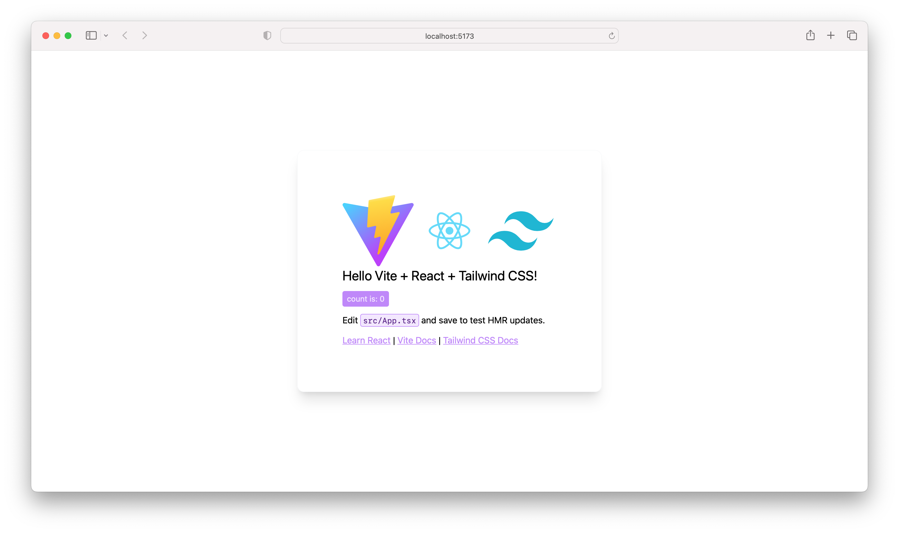
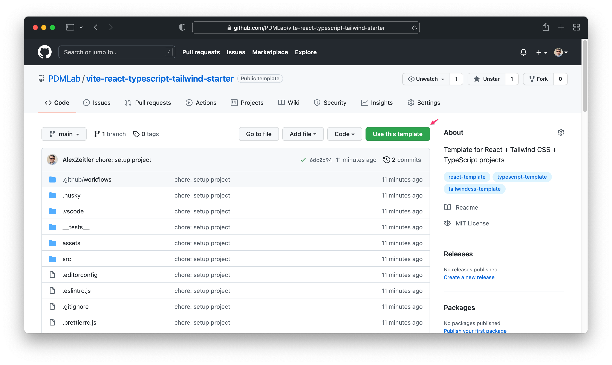

## Commit automatique au format Conventional Commits

Un hook Husky corrige automatiquement le message de commit si ## Database

### ✅ Infrastructure complète

- ## Tests

✅ **Status : Infrastructure complète et robuste**

- **Framework** : Vitest avec configuration série pour éviter les conflits de DB
- **Coverage** : 33/33 tests réussissent (100% des fonctionnalités critiques)
- **Types de tests** :
  - Tests d'intégration API (22 tests) 
  - Tests unitaires services (11 tests)
- **Isolation** : Base de test séparée avec fixtures automatiques
- **CI/CD** : Husky empêche les commits si tests ou lint échouent
- **Configuration** : Tests en série (`singleFork: true`) pour éliminer les conflits de concurrencee principale** : `backend/database/database.db` - Base de production avec schéma complet
- **Base de test** : `backend/database/test.db` - Base isolée pour les tests automatisés
- **Sélection automatique** : Le système choisit la bonne base selon l'environnement
- **Fixtures** : Système d'injection de données de test avec FK cohérentes
- **Tests** : 33/33 tests passent avec isolation complète des bases

### Initialisation des bases de données

```bash
# Base principale (production)
node backend/src/initDatabase.ts

# Base de test (développement)
node backend/src/initTestDatabase.ts
```

La structure complète, les tables, relations et migrations sont documentées dans :  
➡️ [backend/database/docs/database-structure.md](backend/database/docs/database-structure.md)Conventional Commit n'est pas respecté.
Si tu fais un commit avec un message libre, il sera préfixé par `chore:` pour garantir la conformité.

Exemple :
```
git commit -m "ajout doc et tests"
```
devient automatiquement :
```
chore: ajout doc et tests
```
Ce mécanisme permet de ne jamais bloquer les commits à cause du format.
# Board Game Score Tracker

Application web pour gérer les parties de jeux de société, suivi multi-modes, gestion des personnages, statistiques avancées, et intégration BoardGameGeek.



## ✅ État du Projet

- **Backend** : 100% fonctionnel avec 33/33 tests qui passent ✅
- **API REST** : 10 endpoints avec validation complète ✅
- **Base de données** : SQLite avec schéma complet et fixtures ✅
- **Tests d'intégration** : Coverage complète des endpoints ✅
- **Tests unitaires** : Tous les services backend testés ✅
- **Frontend** : En développement - Structure et pages principales ⏳

## About

Board Game Score Tracker propose une stack moderne, des outils de qualité et une structure modulaire pour le suivi des jeux de société.

## Libraries

- **Node 24**
- **React 19**
- **React Router 6**
- **Tailwind CSS 3.4** (+ forms plugin)
- **TypeScript 5.x**
- **Vite 7**
- **Vitest**
- **Express.js 5** (backend)
- **better-sqlite3** (SQLite 3.x)
- **Radix UI**
- **Phosphor Icons React**

## Tools

- **Commitlint 19**
- **Conventional Commits**
- **EditorConfig**
- **ESLint 8**
- **Prettier 3**
- **Husky 8**
- **VS Code settings**


## Documentation API

Consultez la documentation complète des endpoints backend ici : [API_DOC.md](./API_DOC.md)

## Tests automatisés

✅ **Status : 33/33 tests réussissent** (Septembre 2025)

- **Tests d'intégration** : 22 tests couvrant tous les endpoints API
- **Tests unitaires backend** : 11 tests pour tous les services
- **Coverage** : 100% des fonctionnalités critiques
- **Isolation** : Tests en série pour éviter les conflits de base de données
- **Fixtures** : Système d'injection automatique pour des données de test cohérentes

Consultez la documentation détaillée : [__tests__/backend/README.md](./__tests__/backend/README.md)

## Project Structure

```
boardGameScore/
├── assets/                # Images, screenshots
├── backend/
│   ├── database/
│   │   └── docs/
│   │       └── database-structure.md  # Documentation complète de la base
│   ├── src/
│   │   └── server.ts      # Serveur Express principal
│   └── tsconfig.json
├── src/                   # Frontend React + TypeScript
│   ├── App.tsx
│   ├── main.tsx
│   └── ...                # Styles, assets, etc.
├── __tests__/             # Tests unitaires
├── .husky/                # Hooks Git
├── .editorconfig
├── .prettierrc.cjs
├── commitlint.config.cjs
├── eslint.config.cjs
├── package.json
├── README.md
└── CONTEXT.md             # Règles IA et standards projet
```

## Usage

```bash
npm install
npm run dev
npm run test
```



## Scripts

- `npm run dev` : Démarrage frontend/backend en mode développement
- `npm run lint` : Vérification ESLint (aucune erreur)
- `npm run format` : Formatage Prettier automatique
- `npm run test` : **33/33 tests réussissent** ✅
- `npm run build` : Build production optimisé

## Database

### Initialisation de la base de données

Deux scripts permettent d’initialiser les bases SQLite :

- **Base principale** : `node backend/src/initDatabase.ts` crée/initialise la base réelle (`database.db`) avec le schéma complet.
- **Base de test** : `node backend/src/initTestDatabase.ts` crée/initialise une base dédiée aux tests (`test.db`) avec le même schéma.

La structure complète, les tables, relations, migrations et requêtes sont documentées dans : ➡️ [backend/database/docs/database-structure.md](backend/database/docs/database-structure.md)

## Standards & Constraints

- Pas de type `any`
- Séparation stricte frontend/backend
- Modularité et tests obligatoires
- Migrations pour toute modif DB
- Validation et sécurité systématiques
- Documentation à jour (CONTEXT.md, database-structure.md, README.md)
- Conventions de commit et scripts qualité

## Documentation

- [CONTEXT.md](CONTEXT.md) : Règles IA, standards, workflow
- [backend/database/docs/database-structure.md](backend/database/docs/database-structure.md) : Structure DB
- [commitlint.config.cjs](commitlint.config.cjs) : Convention de commit
- [eslint.config.cjs](eslint.config.cjs) : Linting
- [.prettierrc.cjs](.prettierrc.cjs) : Formatage

## Tests

- **Vitest** : Tests unitaires backend/frontend
- **Coverage** : >80% requis
- **Husky** : Empêche les commits si tests ou lint échouent
